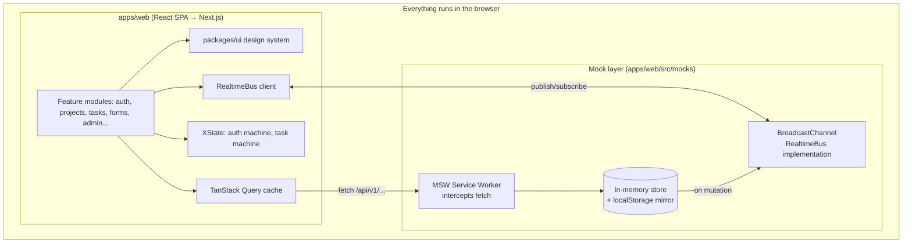
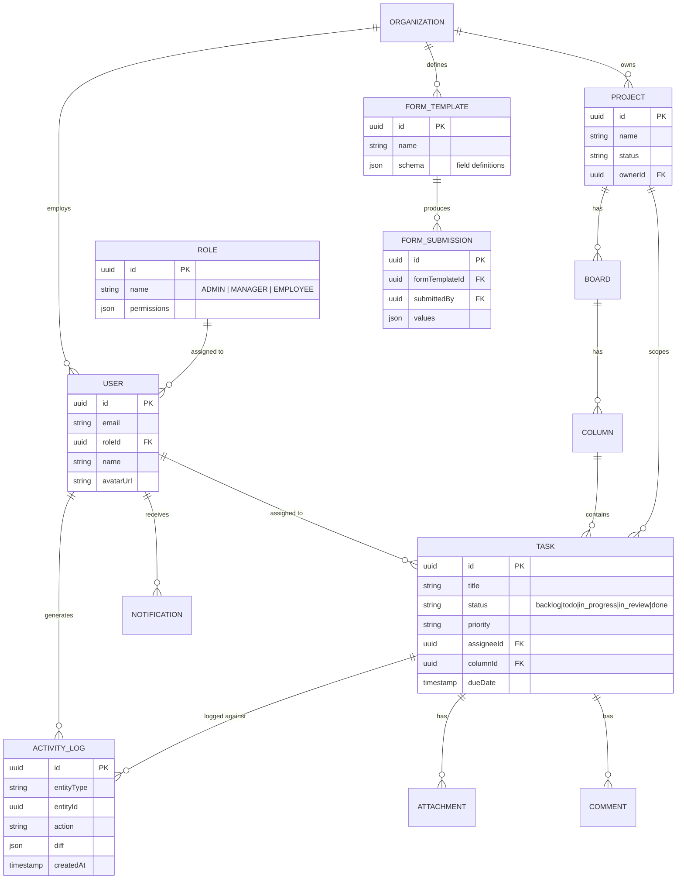
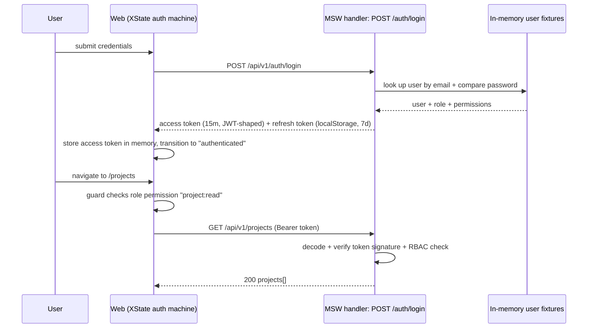
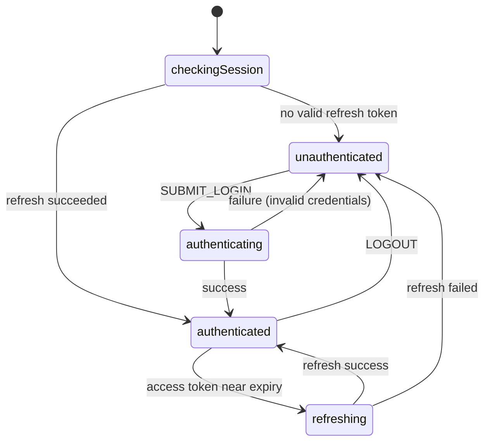
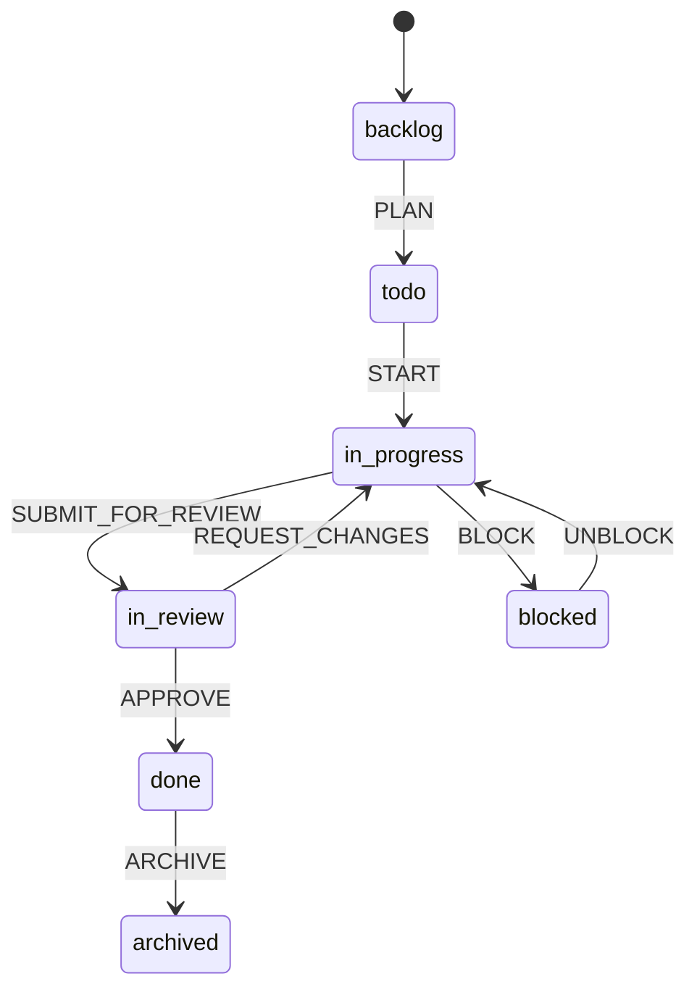
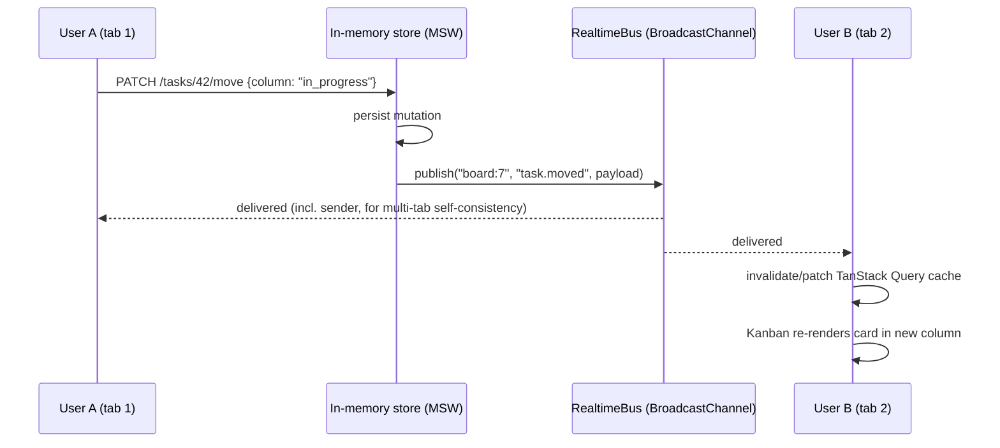

# Enterprise Workforce & Project Management Platform — Architecture

Status: **Phases 0–2 built** (monorepo scaffold, design system, code generator). This document is
the single source of truth for the system design going forward.

This is a **frontend-only** project — there is no server process to deploy or operate. Every one
of the 12 "internship tasks" is built as a natural part of one coherent product (a
Jira/ClickUp/Monday/Notion-style platform), with a mocked network layer standing in for a real
backend wherever one would normally exist.

---

## 1. Product framing

One product: **"Forge"** (working name) — a workforce & project management platform.

Every one of the 12 learning tasks maps onto a real product surface, not a separate demo:

| # | Learning task | Where it lives in the product |
|---|---|---|
| 1 | Design System | `packages/ui` — used by every screen |
| 2 | Real-Time Todo | The Kanban board's live task cards |
| 3 | Dashboard | `/dashboard` analytics home |
| 4 | Auth (JWT + RBAC) | Login, guarded routes, Admin/Manager/Employee permissions |
| 5 | Dynamic Form Engine | Admin-defined intake forms (leave requests, onboarding, custom project fields) |
| 6 | Micro Frontend | Feature-module isolation inside `apps/web` |
| 7 | Custom React Renderer | `/experiments/mini-react` — isolated, not shipped to prod |
| 8 | E2E Testing | Playwright suite covering login → project → task |
| 9 | State Machines | XState for auth session lifecycle and task workflow |
| 10 | Performance | Lazy loading, memoization, virtualization, code-splitting across the app |
| 11 | Code Generator | `tools/codegen` CLI used to scaffold every new feature module |
| 12 | Next.js | Phase-2 migration of `apps/web` once the React/Vite version is feature-complete |

---

## 2. Guiding principles (why the shape of this system looks the way it does)

1. **Frontend-only, and the mock layer is a real architectural seam, not a shortcut.** There is
   deliberately no `apps/api`. Instead, **Mock Service Worker (MSW)** intercepts network calls at
   the browser level and serves them from an in-memory store. The consuming code (TanStack Query
   hooks, the typed SDK) has no idea it's talking to a mock — it calls `fetch("/api/v1/projects")`
   exactly as it would against a real server. That's the point: if this project ever grows a real
   backend, the swap is "delete the MSW handlers," not "rewrite the frontend."
2. **Modular monolith, not a distributed system.** True micro-frontends (independent deploys via
   Module Federation, separate repos per team) solve an org-scaling problem you don't have yet —
   one developer, one repo. We get the *learning value* (isolation, clear contracts between
   features) without the *operational cost*. Each feature is a self-contained module with its own
   routes, state, and data-access layer, loaded via `React.lazy` code-splitting — a "feature-sliced"
   architecture. If you later want to graduate a module to a real micro-frontend, the boundary is
   already there.
3. **Server state and client state are different problems.** Data that conceptually lives on a
   server (projects, tasks, users — even though "server" here is a mock) is managed by
   **TanStack Query** (caching, refetching, optimistic updates). Data that is purely a client-side
   workflow (is the login form mid-submit, which Kanban column is being dragged) is managed by
   **XState** or local component state. Mixing these into one global store is the #1 cause of
   stale-cache bugs in apps like this.
4. **One data model, modeled once, reused everywhere.** Dashboard analytics, reports, and activity
   logs are all *read models* over the same core entities (`packages/types`), seeded into the same
   in-memory mock store — not separate systems with separate fixtures.
5. **Realtime is additive, not foundational.** The mock REST layer is the source of truth for
   every mutation (create task, move card) — it writes to the in-memory store first. A
   `RealtimeBus` abstraction then *notifies* other open tabs that something changed, so they
   refetch/patch their cache. This means the app works correctly even if the realtime channel
   drops — it degrades to "stale until next refetch," not to broken state. Critically, this bus is
   an interface (`publish`/`subscribe`), not a concrete dependency on any transport — swapping the
   `BroadcastChannel` implementation for a real `socket.io-client` later touches one file.
6. **Build the React version to completion first, then migrate to Next.js.** Migrating too early
   means re-learning routing/data-fetching mid-project. Migrating a *finished* app is itself the
   valuable lesson in task #12.
7. **The code generator isn't a gimmick bolted on at the end.** It's introduced right after the
   Design System phase and used to scaffold every subsequent feature module, so tasks #1 and #11
   reinforce each other instead of being isolated exercises.

---

## 3. Tech stack and rationale

### Frontend (Phase 1: React + Vite → Phase 2: Next.js)

| Layer | Choice | Why |
|---|---|---|
| Framework | React 18 + TypeScript | Industry default; TS catches the schema/contract bugs that sink apps this size |
| Build tool | Vite | Instant HMR during the long build-out; swapped for Next.js in the final phase |
| Routing | React Router v6 → Next.js App Router | RRv6 nested routes map cleanly onto Next's file-based routing later |
| Server state | TanStack Query | Caching, retries, optimistic updates, cache invalidation on realtime-bus events |
| Client/workflow state | XState | Auth session lifecycle and task workflow are genuine finite state machines — modeling them explicitly prevents "impossible state" bugs (e.g., a task that's both `archived` and `in-progress`) |
| Local UI state | Zustand | Thin global store for things like sidebar-collapsed, active-workspace — no boilerplate |
| Styling | Tailwind CSS v4 | Utility-first, pairs naturally with a hand-rolled design system in `packages/ui` |
| Design system | Custom (`packages/ui`), Radix UI primitives underneath for accessibility (focus trap, portals) | Task #1 requires you to *build* the components; Radix supplies the unglamorous a11y plumbing so you focus on API design and styling |
| Forms | React Hook Form + Zod | RHF for performant uncontrolled forms; Zod schemas double as the Dynamic Form Engine's validation layer |
| Charts | Recharts | Composable, SVG-based, easiest to theme to match the design system |
| Drag & drop (Kanban) | dnd-kit | Modern, accessible, tree-shakeable — lighter than react-beautiful-dnd (unmaintained) |
| E2E testing | Playwright | Faster, multi-browser, better network-mocking than Cypress |

### Mock API & realtime layer (replaces a backend)

| Layer | Choice | Why |
|---|---|---|
| API mocking | **MSW (Mock Service Worker)** | Intercepts `fetch` at the network level via a real Service Worker in the browser (and via `setupServer` in Node for Vitest) — the same handler definitions run in dev, Storybook, and tests. Components never know they're talking to a mock. |
| Fixtures/factories | Plain TS factories + `@faker-js/faker` | Typed against `packages/types`, produce realistic demo data (names, dates, org structure) without hand-writing hundreds of JSON records |
| Persistence | In-memory store (module singleton), optionally mirrored to `localStorage` | Mutations (create task, move card) actually write, so optimistic UI + refetch behavior is real within a session. Resets on hard reload — expected and fine for a mock layer |
| Auth | Hand-rolled JWT-*shaped* tokens (base64url header.payload.signature, HMAC-signed with a dev-only constant via Web Crypto) issued by an MSW `/auth/login` handler | Structurally a real JWT — decodable, inspectable, expires — without needing a real auth server. The XState auth machine and RBAC guards exercise real token logic, just against a fixture user table instead of a database |
| Realtime | `RealtimeBus` interface, `BroadcastChannel`-backed implementation | Simulates "another user moved a task" across browser tabs with zero server process. The interface is the seam: a `socket.io-client` implementation could satisfy the same interface later without touching consumers |
| File uploads | MSW-intercepted `POST /uploads` + `URL.createObjectURL` for local preview | No real storage needed; still exercises the upload UI, progress state, and attachment list end-to-end |

### Tooling / repo

| Layer | Choice | Why |
|---|---|---|
| Monorepo | pnpm workspaces + Turborepo | Caches builds/tests per package, exactly the structure that supports "every feature is isolated" |
| Lint/format | ESLint + Prettier, shared config package | Consistency across every generated module |
| Component workshop | Storybook | Where the design system (task #1) is developed and visually tested in isolation |
| CI | GitHub Actions | Lint → typecheck → unit → Playwright, on every push |

---

## 4. Monorepo layout

```
forge/
├── apps/
│   └── web/                      # React (Vite) app — becomes Next.js in Phase 2
│       └── src/
│           ├── app/               # app shell: router, providers, layout
│           ├── modules/           # <-- "micro-frontend" isolation boundary
│           │   ├── auth/          # login, register, session (XState machine lives here)
│           │   ├── employees/
│           │   ├── projects/
│           │   ├── tasks/         # kanban board, task detail (XState machine lives here)
│           │   ├── dashboard/
│           │   ├── forms/         # dynamic form engine + admin form builder
│           │   ├── notifications/
│           │   ├── reports/
│           │   ├── activity-log/
│           │   ├── settings/
│           │   └── admin/
│           ├── mocks/             # MSW handlers, fixtures, in-memory store, realtime bus
│           │   ├── handlers/       # one file per domain (auth, projects, tasks, forms, ...)
│           │   ├── fixtures/       # faker-backed factory functions + seed data
│           │   ├── db.ts            # in-memory store (+ optional localStorage mirror)
│           │   ├── realtime.ts      # RealtimeBus interface + BroadcastChannel implementation
│           │   ├── browser.ts       # MSW worker setup (dev)
│           │   └── server.ts        # MSW node server setup (Vitest)
│           └── lib/                # realtime client, query client, typed fetch client
├── packages/
│   ├── ui/                       # Design system: Button, Modal, Table, Form, Card, Badge, Avatar, Toast
│   ├── types/                    # Shared TS types + Zod schemas — the data model's source of truth
│   ├── config/                   # eslint/tsconfig/tailwind shared config
│   └── sdk/                      # typed fetch client + realtime event contracts, consumed by web
├── tools/
│   └── codegen/                  # CLI: generates a new module/component/hook from templates
├── experiments/
│   └── mini-react/               # custom React renderer — isolated learning sandbox, not built into apps/web
└── e2e/                          # Playwright tests (cross-cutting: login → projects → tasks)
```

Each `modules/<feature>/` folder in `apps/web` is self-contained: its own components, hooks,
XState machines (if any), TanStack Query hooks, and a single `routes.tsx` that the app shell
lazy-imports. A module never imports another module's internals — only `packages/ui`,
`packages/types`, and `packages/sdk`. That rule *is* the micro-frontend boundary (task #6).

---

## 5. High-level system architecture



---

## 6. Core domain model

This is the shape of the data — implemented as TypeScript interfaces + Zod schemas in
`packages/types`, and seeded into the in-memory mock store by `apps/web/src/mocks/fixtures`. It is
not a live database schema, but it's designed as if it were one, so the model transfers cleanly if
a real backend is ever added.



---

## 7. Authentication & RBAC

Sequence for login + guarded access — `A` is an MSW handler, not a real server, but the client code
can't tell the difference:



Auth session lifecycle as an explicit XState machine (task #9):



RBAC model: permissions are attached to `Role` as a JSON permission set
(`{"project:read": true, "project:write": false, ...}`), checked both:
- **in the MSW handler** (so a direct `fetch()` bypassing the UI still gets a real 401/403 — the
  same discipline as "never trust the client," just against a mock instead of a real server), and
- **client-side** to hide/disable UI (`<Can I="project:write">…</Can>` component in `packages/ui`).

Three seeded roles: `ADMIN` (full access + admin panel), `MANAGER` (manage own projects/team),
`EMPLOYEE` (view assigned work, submit forms, comment).

---

## 8. Task workflow state machine



This machine is the single source of truth for which drag-and-drop moves are legal on the Kanban
board — a card can't be dragged straight from `backlog` to `done`; the UI derives allowed columns
from `machine.nextEvents`, and the MSW handler for `PATCH /tasks/:id/move` runs the *same* machine
definition (shared from `packages/types`) to reject illegal transitions — so "the backend
validates it too" remains true even though the backend is a mock.

---

## 9. Real-time collaboration

- The `RealtimeBus` interface (`publish(channel, event)` / `subscribe(channel, handler)`) is
  implemented with `BroadcastChannel`, scoped per board: `board:<boardId>`. Opening a project's
  Kanban view in two tabs subscribes both to the same channel — genuinely separate browser
  contexts, genuinely asynchronous, which is what makes this a real test of the pattern and not
  just a callback.
- Every mutation (`POST /tasks`, `PATCH /tasks/:id/move`, `POST /comments`) is written to the
  in-memory store first (the mock REST layer is the source of truth), then the MSW handler
  publishes a domain event (`task.moved`, `task.created`, `comment.added`) on the bus.
- Clients don't trust the bus payload as the full state — they use it as an invalidation signal for
  TanStack Query (`queryClient.invalidateQueries(['tasks', boardId])`) or apply an optimistic patch
  and reconcile on next fetch. This means a missed event self-heals on the next window focus or
  manual refresh — no permanently-stale UI, and it's the same pattern a real Socket.IO integration
  would use.
- Presence (who's viewing this board right now) is a thin layer on top: joining a channel
  publishes `presence:join`/`presence:leave`.



---

## 10. Dynamic Form Engine

Admins define forms as JSON, stored in the mock store's `FORM_TEMPLATE.schema` field:

```json
{
  "title": "Leave Request",
  "fields": [
    { "id": "reason", "type": "textarea", "label": "Reason", "required": true },
    { "id": "startDate", "type": "date", "label": "Start date", "required": true },
    { "id": "endDate", "type": "date", "label": "End date", "required": true },
    { "id": "type", "type": "select", "label": "Leave type",
      "options": ["sick", "vacation", "unpaid"] },
    { "id": "approverNote", "type": "text", "label": "Note to approver", "visibleIf": { "type": "unpaid" } }
  ]
}
```

- A single `<DynamicFormRenderer schema={schema} />` component in `modules/forms` walks the
  `fields[]` array and renders the matching `packages/ui` input for each `type`, wired through
  React Hook Form.
- The same JSON schema is compiled to a **Zod schema at runtime** (a small `jsonSchemaToZod`
  mapper) so client validation and the MSW handler's server-side validation use the identical Zod
  schema — they can never drift, because they're the same object.
- Admin builds forms visually via a form-builder screen (drag fields, reorder, set `required`) —
  that screen itself is built from the *static* design-system components, while its *output* is
  what the dynamic renderer consumes.
- `visibleIf` gives you conditional-field logic without a scripting engine.

---

## 11. Custom React Renderer (`/experiments/mini-react`)

Deliberately isolated from `apps/web` — imported by nothing else. Goal: implement a minimal
reconciler (à la "Build your own React") that can render a small JSON UI tree
(`{type: "div", props, children}`) to real DOM nodes, with:
1. A `createElement`/`render` pair
2. A fiber-less recursive diff (v1) → optionally a work-loop with `requestIdleCallback` (v2, if
   time allows)
3. Function components + a minimal `useState`

This stays a sandbox specifically so it never risks destabilizing the real app — it's there to
build intuition for *why* React's APIs are shaped the way they are, not to be reused.

---

## 12. Performance strategy (applied throughout, not a separate phase)

| Technique | Where |
|---|---|
| Route-level code splitting | Every `modules/*` is `React.lazy` + `Suspense` at the router level |
| List virtualization | Task lists, activity log, employee directory (`@tanstack/react-virtual`) |
| Memoization | `React.memo` on Kanban cards, `useMemo`/`useCallback` for derived board data, TanStack Query's built-in caching to avoid refetch storms |
| Debounced search/filter | Employee/project search inputs |
| Image/avatar optimization | Lazy `loading="lazy"`, responsive avatar sizes |
| Bundle analysis | `rollup-plugin-visualizer` in CI to catch regressions |
| Next.js phase | Route-based SSR/streaming, RSC for static dashboard chrome, `next/image` |

---

## 13. Testing strategy

- **Unit**: Vitest for pure logic (XState machine transitions, Zod schemas, RBAC permission
  checks) and `packages/ui` components (React Testing Library). Component tests that touch data
  fetching run against the same MSW handlers as dev (`setupServer` in `apps/web/src/mocks/server.ts`)
  — so tests exercise real request/response handling instead of manually mocked `fetch`.
- **E2E (Playwright)**: three critical-path specs required before anything else —
  `auth.spec.ts` (login, bad credentials, logout), `projects.spec.ts` (create project → appears
  in list), `tasks.spec.ts` (create task, drag across Kanban columns, verify persisted status).
  Runs against the real app with MSW active (no separate "test backend" to stand up). Headless in
  CI on every push via GitHub Actions.

---

## 14. Code generator CLI (`tools/codegen`)

A Node CLI (Commander + Handlebars templates) invoked as:

```
pnpm gen module employees-directory
pnpm gen component DataTable --package=ui
pnpm gen hook useProjectFilters --module=projects
```

Templates enforce the module contract from §4 (routes.tsx, index barrel, colocated tests) so
every generated feature starts structurally identical — this is what makes 10+ feature modules
maintainable by one person.

---

## 15. Next.js migration (after the React version is feature-complete)

- `apps/web` (Vite) → `apps/web-next` built in parallel, cut over when parity is reached; old app
  deleted once verified.
- React Router routes → App Router file structure (1:1 mapping, since modules already own their
  route trees).
- MSW works in Next.js too (browser + server contexts, with `msw/node` for server components) —
  the mock layer doesn't need to change just because the framework did. If a real backend is ever
  added, Next.js Route Handlers are a natural 1:1 replacement for the MSW handlers.
- Dashboard and reports screens become candidates for React Server Components + streaming, since
  they're read-heavy.
- The `RealtimeBus` abstraction is unaffected by the framework swap — only a future transport
  implementation (e.g. a real socket) would change, not the consumers.

---

## 16. Development roadmap

Each phase produces a working, demoable increment — nothing is "half-built" across phases.

| Phase | Module | Key deliverables | Learning task(s) |
|---|---|---|---|
| 0 | Repo & tooling | pnpm+Turborepo monorepo, ESLint/Prettier/TS configs, CI skeleton | groundwork ✅ |
| 1 | Design System | Button, Modal, Table, Form primitives, Card, Badge, Avatar, Toast in `packages/ui` + Storybook | #1 ✅ |
| 2 | Code generator | `tools/codegen` CLI, module template, used from here on for every new module | #11 ✅ |
| 3 | Mock API layer | MSW setup (browser + node), fixtures/factories, in-memory store, `RealtimeBus` abstraction, seed data | groundwork |
| 4 | Auth + RBAC | JWT-shaped tokens via MSW, XState auth machine, route guards, `<Can/>` permission component | #4, #9 (auth part) |
| 5 | Employee Management | Directory, profile, role assignment (Admin) | core feature |
| 6 | Project Management | CRUD projects, project members, project settings | core feature |
| 7 | Task Management + Kanban | Boards/columns/tasks CRUD, dnd-kit board, XState task machine | #2 (foundation), #9 (task part) |
| 8 | Real-time collaboration | `RealtimeBus` + `BroadcastChannel`, live Kanban sync across tabs, presence, live comments | #2 (completes real-time) |
| 9 | Dashboard Analytics | Recharts widgets: tasks by status, workload per employee, project health | #3 |
| 10 | Dynamic Form Engine | JSON schema model, renderer, admin form builder, 2 real forms (leave request, project intake) | #5 |
| 11 | Notifications | In-app notification center, real-time push via `RealtimeBus`, read/unread state | core feature |
| 12 | File uploads | Task/comment attachments via mocked upload endpoint + object URLs | core feature |
| 13 | Activity logs | Audit trail on task/project mutations, activity feed UI (virtualized list) | core feature |
| 14 | Reports | Exportable (CSV/PDF) aggregate reports over projects/tasks/employees | core feature |
| 15 | Settings + Admin panel | Org settings, role/permission management, form-template management | core feature |
| 16 | Performance pass | Audit + apply lazy loading, memoization, virtualization, bundle analysis across all modules | #10 |
| 17 | E2E testing | Playwright suite: auth, projects, tasks (+ CI wiring) | #8 |
| 18 | Custom React Renderer | `/experiments/mini-react`, done in parallel/whenever — fully isolated | #7 |
| 19 | Next.js migration | Cut `apps/web` over to Next.js per §15 | #12 |

Phases 0–8 are the critical path (nothing else works without auth/projects/tasks/realtime).
Phases 9–15 can be reordered based on your interest. Phases 16–18 are cross-cutting/parallelizable.
Phase 19 is deliberately last.

---

## 17. Confirmed decisions

1. Monorepo: **pnpm + Turborepo**.
2. E2E tool: **Playwright**.
3. **Frontend-only** — no server process. Mocked via **Mock Service Worker (MSW)**, chosen over a
   minimal in-memory dev server (would mean `pnpm dev` running two processes) or pure client-side
   state (would make JWT auth and realtime purely cosmetic). Decided 2026-07-21.
4. `apps/api` removed; the Postgres/Prisma/Redis/Fastify stack from the original design is dropped
   entirely in favor of the mock layer in §3. Decided 2026-07-21.

No open questions remain. Ready for Phase 3.
