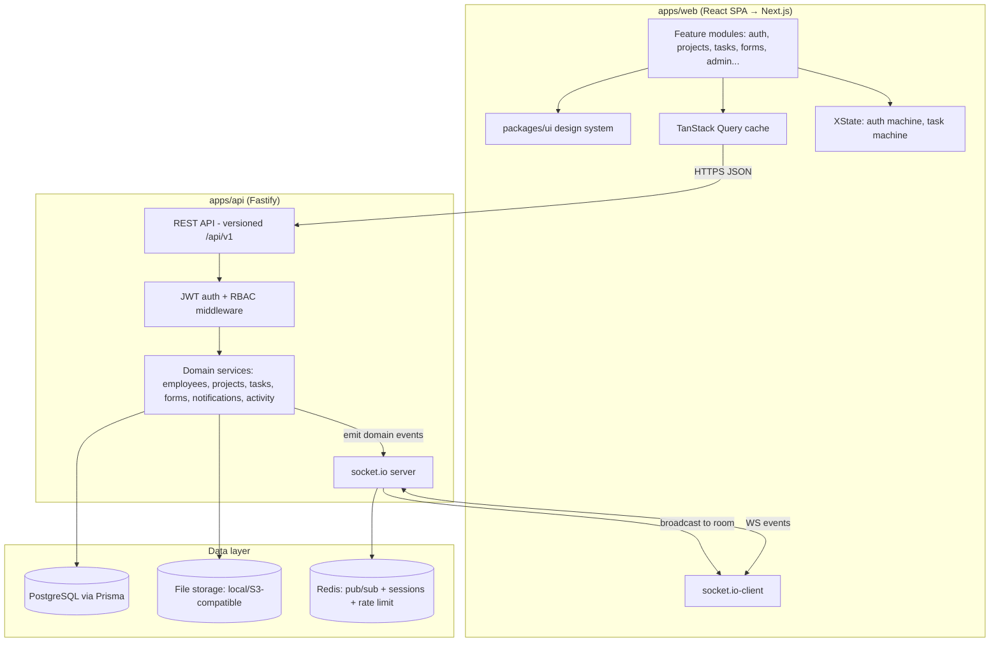
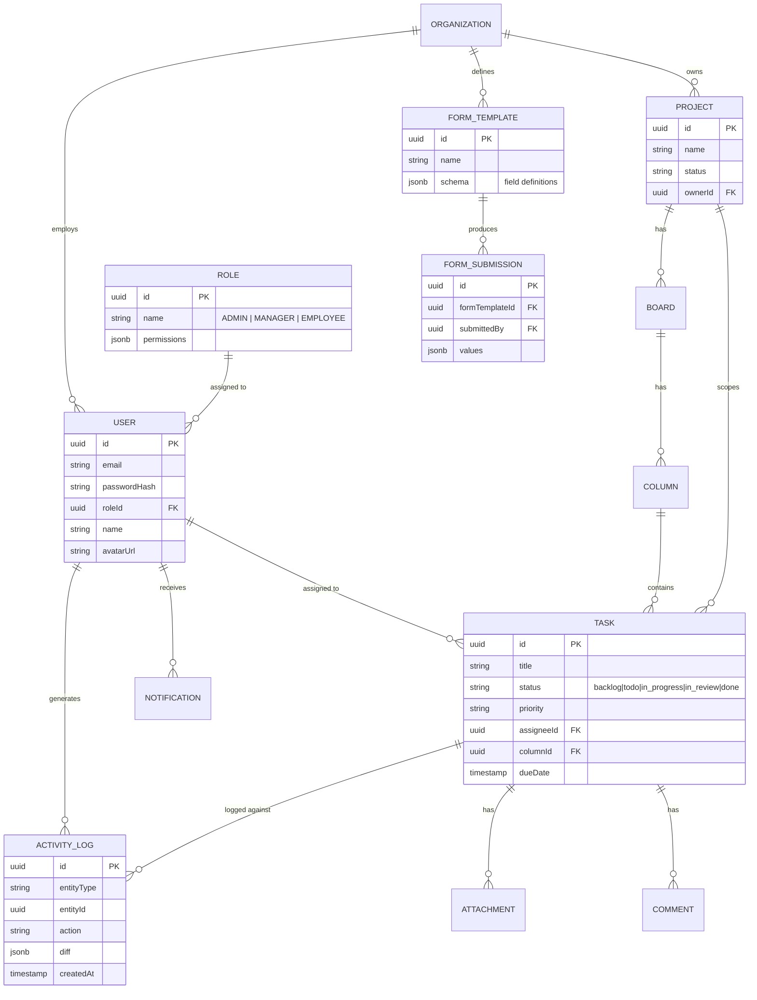
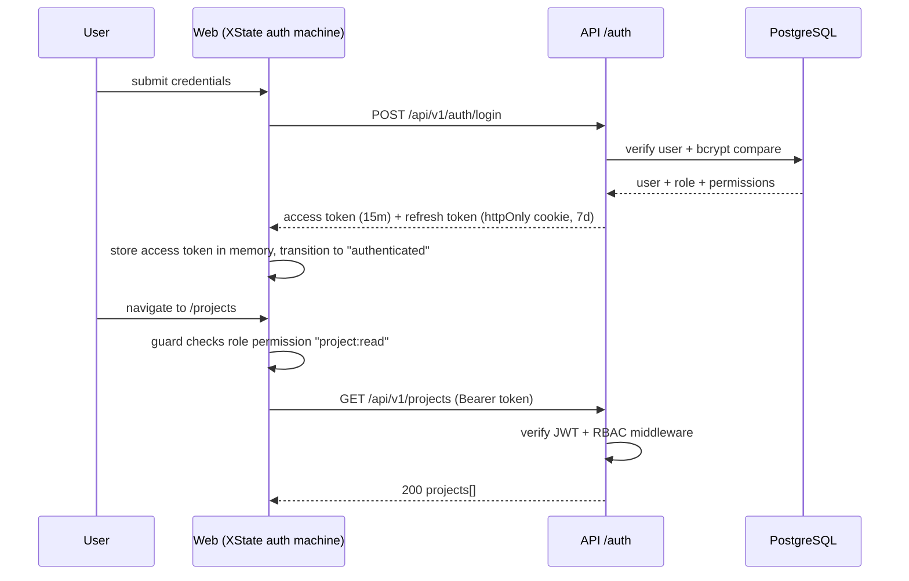
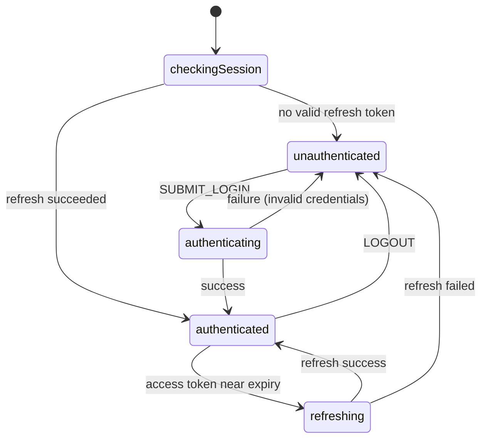
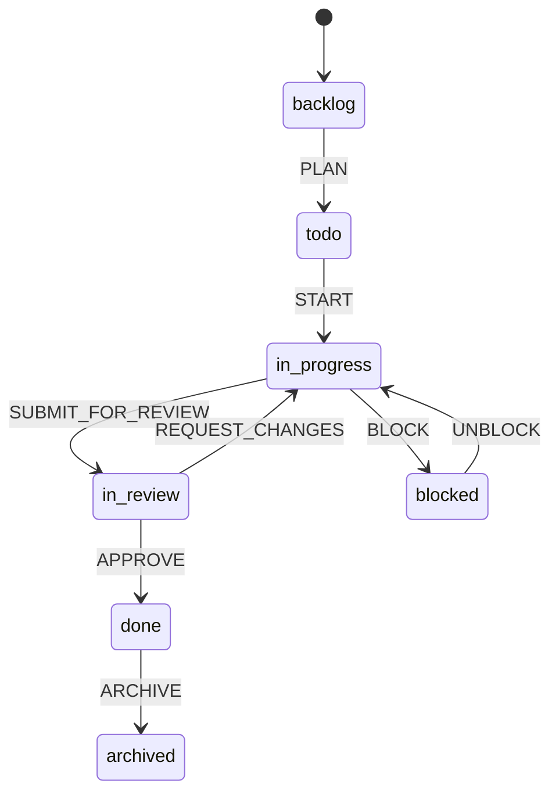
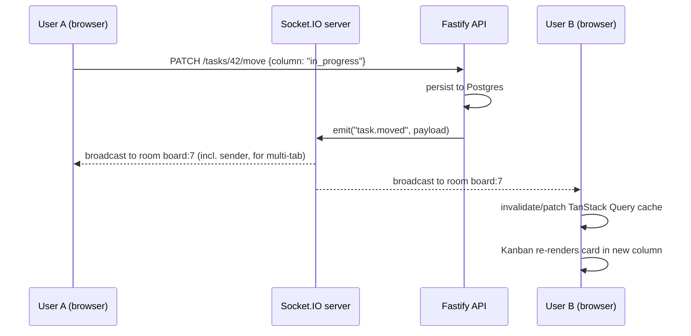

# Enterprise Workforce & Project Management Platform — Architecture

Status: **DESIGN — awaiting approval. No application code has been written yet.**

This document is the single source of truth for the system design. It exists so that the 12
"internship tasks" are not built as 12 disconnected toy projects, but as natural parts of one
coherent product — the way a senior engineer would actually plan a Jira/ClickUp/Monday/Notion
competitor.

---

## 1. Product framing

One product: **"Forge"** (working name) — a workforce & project management platform.

Every one of the 12 learning tasks maps onto a real product surface, not a separate demo:

| # | Learning task | Where it lives in the product |
|---|---|---|
| 1 | Design System | `packages/ui` — used by every screen |
| 2 | Real-Time Todo | The Kanban board's live task cards |
| 3 | Dashboard | `/dashboard` analytics home |
| 4 | Auth (JWT + RBAC) | Login, guarded routes, Admin/Manager/Employee permissions |
| 5 | Dynamic Form Engine | Admin-defined intake forms (leave requests, onboarding, custom project fields) |
| 6 | Micro Frontend | Feature-module isolation inside `apps/web` |
| 7 | Custom React Renderer | `/experiments/mini-react` — isolated, not shipped to prod |
| 8 | E2E Testing | Playwright suite covering login → project → task |
| 9 | State Machines | XState for auth session lifecycle and task workflow |
| 10 | Performance | Lazy loading, memoization, virtualization, code-splitting across the app |
| 11 | Code Generator | `tools/codegen` CLI used to scaffold every new feature module |
| 12 | Next.js | Phase-2 migration of `apps/web` once the React/Vite version is feature-complete |

---

## 2. Guiding principles (why the shape of this system looks the way it does)

1. **Modular monolith, not a distributed system.** True micro-frontends (independent deploys via
   Module Federation, separate repos per team) solve an org-scaling problem you don't have yet —
   one developer, one repo. We get the *learning value* (isolation, clear contracts between
   features) without the *operational cost* (multiple build pipelines, runtime integration bugs,
   version skew). Each feature is a self-contained module with its own routes, state, and API
   layer, loaded via `React.lazy` code-splitting — a "feature-sliced" architecture. If you later
   want to graduate a module to a real micro-frontend, the boundary is already there.
2. **Server state and client state are different problems.** Data that lives on the server
   (projects, tasks, users) is managed by **TanStack Query** (caching, refetching, optimistic
   updates). Data that is purely a client-side workflow (is the login form mid-submit, which
   Kanban column is being dragged) is managed by **XState** or local component state. Mixing
   these into one global Redux store is the #1 cause of stale-cache bugs in apps like this.
3. **One database, modeled once, reused everywhere.** Dashboard analytics, reports, and activity
   logs are all *read models* over the same core schema — not separate systems. We avoid building
   three different "sources of truth."
4. **Realtime is additive, not foundational.** REST/JSON is the source of truth for every
   mutation (create task, move card). Socket.IO is a *notification layer* that tells connected
   clients "something changed, go refetch/patch your cache." This means the app works correctly
   even if a websocket drops — it degrades to polling/refetch-on-focus, not to broken state.
5. **Build the React version to completion first, then migrate to Next.js.** Migrating too early
   means re-learning routing/data-fetching mid-project. Migrating a *finished* app is itself the
   valuable lesson in task #12 (you feel exactly what Next.js buys you: SSR, RSC, file routing,
   API routes replacing your Express server).
6. **The code generator isn't a gimmick bolted on at the end.** It's introduced right after the
   Design System phase and used to scaffold every subsequent feature module, so tasks #1 and #11
   reinforce each other instead of being isolated exercises.

---

## 3. Tech stack and rationale

### Frontend (Phase 1: React + Vite → Phase 2: Next.js)

| Layer | Choice | Why |
|---|---|---|
| Framework | React 18 + TypeScript | Industry default; TS catches the schema/contract bugs that sink apps this size |
| Build tool | Vite | Instant HMR during the long build-out; swapped for Next.js in the final phase |
| Routing | React Router v6 → Next.js App Router | RRv6 nested routes map cleanly onto Next's file-based routing later |
| Server state | TanStack Query | Caching, retries, optimistic updates, cache invalidation on socket events |
| Client/workflow state | XState | Auth session lifecycle and task workflow are genuine finite state machines — modeling them explicitly prevents "impossible state" bugs (e.g., a task that's both `archived` and `in-progress`) |
| Local UI state | Zustand | Thin global store for things like sidebar-collapsed, active-workspace — no boilerplate |
| Styling | Tailwind CSS | Utility-first, pairs naturally with a hand-rolled design system in `packages/ui` |
| Design system | Custom (`packages/ui`), Radix UI primitives underneath for accessibility (focus trap, portals) | Task #1 requires you to *build* the components; Radix supplies the unglamorous a11y plumbing so you focus on API design and styling |
| Forms | React Hook Form + Zod | RHF for performant uncontrolled forms; Zod schemas double as the Dynamic Form Engine's validation layer |
| Charts | Recharts | Composable, SVG-based, easiest to theme to match the design system |
| Realtime client | socket.io-client | Pairs with the server choice below; handles reconnection/backoff for you |
| Drag & drop (Kanban) | dnd-kit | Modern, accessible, tree-shakeable — lighter than react-beautiful-dnd (unmaintained) |
| E2E testing | Playwright | Faster, multi-browser, better network-mocking than Cypress; you'll get exposure to the more modern tool. (Cypress is a drop-in alternative if you prefer its DX — noted as swappable.) |

### Backend

| Layer | Choice | Why |
|---|---|---|
| Runtime | Node.js + TypeScript | Shared types with frontend (see `packages/types`) |
| Framework | Fastify | Faster than Express, first-class TS + JSON-schema validation, plugin architecture mirrors our modular-monolith approach on the backend too |
| ORM | Prisma | Type-safe queries, painless migrations, excellent DX for a solo dev |
| Database | PostgreSQL | Relational integrity matters here (roles, permissions, project↔task↔user graphs); JSONB columns handle the Dynamic Form Engine's schema-less form definitions |
| Cache / pub-sub | Redis | Socket.IO adapter for multi-instance pub-sub (even at 1 instance, this is the correct pattern to learn) + session/rate-limit storage |
| Auth | JWT (access + refresh token pair) via `jsonwebtoken`, bcrypt for hashing | Stateless access tokens for API calls, rotating refresh token in an httpOnly cookie — standard, interview-relevant pattern |
| Realtime server | socket.io | Room-per-project / room-per-board model for scoped broadcasts |
| File uploads | Multer → local disk (dev) / S3-compatible bucket via presigned URLs (prod-shaped) | Presigned-URL pattern is what real systems use; local disk keeps dev simple |
| Validation | Zod (shared schema package) | Same schema definitions validate on client (RHF) and server (Fastify) — one definition, no drift |

### Tooling / repo

| Layer | Choice | Why |
|---|---|---|
| Monorepo | pnpm workspaces + Turborepo | Caches builds/tests per package, exactly the structure that supports "every feature is isolated" |
| Lint/format | ESLint + Prettier, shared config package | Consistency across every generated module |
| Component workshop | Storybook | Where the design system (task #1) is developed and visually tested in isolation |
| CI | GitHub Actions | Lint → typecheck → unit → Playwright, on every push |

---

## 4. Monorepo layout

```
forge/
├── apps/
│   ├── web/                      # React (Vite) app — becomes Next.js in Phase 2
│   │   └── src/
│   │       ├── app/               # app shell: router, providers, layout
│   │       ├── modules/           # <-- "micro-frontend" isolation boundary
│   │       │   ├── auth/          # login, register, session (XState machine lives here)
│   │       │   ├── employees/
│   │       │   ├── projects/
│   │       │   ├── tasks/         # kanban board, task detail (XState machine lives here)
│   │       │   ├── dashboard/
│   │       │   ├── forms/         # dynamic form engine + admin form builder
│   │       │   ├── notifications/
│   │       │   ├── reports/
│   │       │   ├── activity-log/
│   │       │   ├── settings/
│   │       │   └── admin/
│   │       └── lib/               # socket client, query client, api client
│   └── api/                      # Fastify server
│       └── src/
│           ├── modules/           # one folder per domain, mirrors frontend modules
│           ├── plugins/           # fastify plugins: auth, sockets, redis, prisma
│           └── prisma/            # schema.prisma, migrations
├── packages/
│   ├── ui/                       # Design system: Button, Modal, Table, Form, Card, Badge, Avatar, Toast
│   ├── types/                    # Shared TS types + Zod schemas (source of truth for both apps)
│   ├── config/                   # eslint/tsconfig/tailwind shared config
│   └── sdk/                      # typed API client + socket event contracts, consumed by web
├── tools/
│   └── codegen/                  # CLI: generates a new module/component/hook from templates
├── experiments/
│   └── mini-react/               # custom React renderer — isolated learning sandbox, not built into apps/web
└── e2e/                          # Playwright tests (cross-cutting: login → projects → tasks)
```

Each `modules/<feature>/` folder in `apps/web` is self-contained: its own components, hooks,
XState machines (if any), TanStack Query hooks, and a single `routes.tsx` that the app shell
lazy-imports. A module never imports another module's internals — only `packages/ui`,
`packages/types`, and `packages/sdk`. That rule *is* the micro-frontend boundary (task #6).

---

## 5. High-level system architecture



---

## 6. Core domain model



---

## 7. Authentication & RBAC

Sequence for login + guarded access:



Auth session lifecycle as an explicit XState machine (task #9):



RBAC model: permissions are attached to `Role` as a JSON permission set
(`{"project:read": true, "project:write": false, ...}`), checked both:
- **server-side** in Fastify middleware (source of truth, never trust the client), and
- **client-side** to hide/disable UI (`<Can I="project:write">…</Can>` component in `packages/ui`).

Three seeded roles: `ADMIN` (full access + admin panel), `MANAGER` (manage own projects/team),
`EMPLOYEE` (view assigned work, submit forms, comment).

---

## 8. Task workflow state machine



This machine is the single source of truth for which drag-and-drop moves are legal on the Kanban
board — a card can't be dragged straight from `backlog` to `done`; the UI derives allowed columns
from `machine.nextEvents`, so the board's behavior and the backend's validation rules are
generated from the same state chart definition (shared in `packages/types`).

---

## 9. Real-time collaboration

- Socket.IO rooms are scoped per board: `board:<boardId>`. Joining a project's Kanban view joins
  that room; leaving unsubscribes.
- Every mutation (`POST /tasks`, `PATCH /tasks/:id/move`, `POST /comments`) is written to
  Postgres first (REST is the source of truth), then the service emits a domain event
  (`task.moved`, `task.created`, `comment.added`) which the socket layer broadcasts to the
  relevant room.
- Clients don't trust the socket payload as the full state — they use it as an invalidation
  signal for TanStack Query (`queryClient.invalidateQueries(['tasks', boardId])`) or apply an
  optimistic patch and reconcile on next fetch. This means a missed/dropped event self-heals on
  the next window focus or manual refresh — no permanently-stale UI.
- Presence (who's viewing this board right now, live cursors on task cards) is a thin layer on
  top: `socket.join(room)` broadcasts `presence:join`/`presence:leave`.



---

## 10. Dynamic Form Engine

Admins define forms as JSON, stored in `FORM_TEMPLATE.schema` (Postgres JSONB):

```json
{
  "title": "Leave Request",
  "fields": [
    { "id": "reason", "type": "textarea", "label": "Reason", "required": true },
    { "id": "startDate", "type": "date", "label": "Start date", "required": true },
    { "id": "endDate", "type": "date", "label": "End date", "required": true },
    { "id": "type", "type": "select", "label": "Leave type",
      "options": ["sick", "vacation", "unpaid"] },
    { "id": "approverNote", "type": "text", "label": "Note to approver", "visibleIf": { "type": "unpaid" } }
  ]
}
```

- A single `<DynamicFormRenderer schema={schema} />` component in `modules/forms` walks the
  `fields[]` array and renders the matching `packages/ui` input for each `type`, wired through
  React Hook Form.
- The same JSON schema is compiled to a **Zod schema at runtime** (a small `jsonSchemaToZod`
  mapper) so client validation and server validation (Fastify route using the identical Zod
  schema) can never drift.
- Admin builds forms visually via a form-builder screen (drag fields, reorder, set `required`) —
  that screen itself is built from the *static* design-system components, while its *output* is
  what the dynamic renderer consumes. This is the cleanest illustration of "dynamic UI from
  config" as a learning exercise.
- `visibleIf` gives you conditional-field logic without a scripting engine.

---

## 11. Custom React Renderer (`/experiments/mini-react`)

Deliberately isolated from `apps/web` — imported by nothing else. Goal: implement a minimal
reconciler (à la "Build your own React") that can render a small JSON UI tree
(`{type: "div", props, children}`) to real DOM nodes, with:
1. A `createElement`/`render` pair
2. A fiber-less recursive diff (v1) → optionally a work-loop with `requestIdleCallback` (v2, if
   time allows)
3. Function components + a minimal `useState`

This stays a sandbox specifically so it never risks destabilizing the real app — it's there to
build intuition for *why* React's APIs are shaped the way they are, not to be reused.

---

## 12. Performance strategy (applied throughout, not a separate phase)

| Technique | Where |
|---|---|
| Route-level code splitting | Every `modules/*` is `React.lazy` + `Suspense` at the router level |
| List virtualization | Task lists, activity log, employee directory (`@tanstack/react-virtual`) |
| Memoization | `React.memo` on Kanban cards, `useMemo`/`useCallback` for derived board data, TanStack Query's built-in caching to avoid refetch storms |
| Debounced search/filter | Employee/project search inputs |
| Image/avatar optimization | Lazy `loading="lazy"`, responsive avatar sizes |
| Bundle analysis | `rollup-plugin-visualizer` in CI to catch regressions |
| Next.js phase | Route-based SSR/streaming, RSC for static dashboard chrome, `next/image` |

---

## 13. Testing strategy

- **Unit**: Vitest for pure logic (XState machine transitions, Zod schemas, RBAC permission
  checks) and `packages/ui` components (React Testing Library).
- **E2E (Playwright)**: three critical-path specs required before anything else —
  `auth.spec.ts` (login, bad credentials, logout), `projects.spec.ts` (create project → appears
  in list), `tasks.spec.ts` (create task, drag across Kanban columns, verify persisted status).
  Run headless in CI on every push via GitHub Actions.

---

## 14. Code generator CLI (`tools/codegen`)

A Node CLI (Commander + Handlebars templates) invoked as:

```
pnpm gen module employees-directory
pnpm gen component DataTable --package=ui
pnpm gen hook useProjectFilters --module=projects
```

Templates enforce the module contract from §4 (routes.tsx, index barrel, colocated tests) so
every generated feature starts structurally identical — this is what makes 10+ feature modules
maintainable by one person.

---

## 15. Next.js migration (Phase 2, after React version is feature-complete)

- `apps/web` (Vite) → `apps/web-next` built in parallel, cut over when parity is reached; old app
  deleted once verified.
- React Router routes → App Router file structure (1:1 mapping, since modules already own their
  route trees).
- Fastify REST endpoints largely stay (mobile/external consumers may still want them); Next.js
  Route Handlers are added for anything that benefits from co-location (e.g., form submission
  handling with server actions).
- Dashboard and reports screens become candidates for React Server Components + streaming, since
  they're read-heavy.
- Socket.IO client logic is unaffected — connects to the same `apps/api` socket server regardless
  of frontend framework.

---

## 16. Development roadmap

Each phase produces a working, demoable increment — nothing is "half-built" across phases.

| Phase | Module | Key deliverables | Learning task(s) |
|---|---|---|---|
| 0 | Repo & tooling | pnpm+Turborepo monorepo, ESLint/Prettier/TS configs, CI skeleton, Postgres+Redis via Docker Compose | groundwork |
| 1 | Design System | Button, Modal, Table, Form primitives, Card, Badge, Avatar, Toast in `packages/ui` + Storybook | #1 |
| 2 | Code generator | `tools/codegen` CLI, module template, used from here on for every new module | #11 |
| 3 | Backend foundation | Prisma schema (§6), Fastify skeleton, seed script (roles, demo org) | groundwork |
| 4 | Auth + RBAC | JWT login/refresh, XState auth machine, route guards, `<Can/>` permission component | #4, #9 (auth part) |
| 5 | Employee Management | Directory, profile, role assignment (Admin) | core feature |
| 6 | Project Management | CRUD projects, project members, project settings | core feature |
| 7 | Task Management + Kanban | Boards/columns/tasks CRUD, dnd-kit board, XState task machine | #2 (foundation), #9 (task part) |
| 8 | Real-time collaboration | Socket.IO server+client, live Kanban sync, presence, live comments | #2 (completes real-time), realtime |
| 9 | Dashboard Analytics | Recharts widgets: tasks by status, workload per employee, project health | #3 |
| 10 | Dynamic Form Engine | JSON schema model, renderer, admin form builder, 2 real forms (leave request, project intake) | #5 |
| 11 | Notifications | In-app notification center, real-time push via existing socket layer, read/unread state | core feature |
| 12 | File uploads | Task/comment attachments, presigned-URL upload flow | core feature |
| 13 | Activity logs | Audit trail on task/project mutations, activity feed UI (virtualized list) | core feature |
| 14 | Reports | Exportable (CSV/PDF) aggregate reports over projects/tasks/employees | core feature |
| 15 | Settings + Admin panel | Org settings, role/permission management, form-template management | core feature |
| 16 | Performance pass | Audit + apply lazy loading, memoization, virtualization, bundle analysis across all modules | #10 |
| 17 | E2E testing | Playwright suite: auth, projects, tasks (+ CI wiring) | #8 |
| 18 | Custom React Renderer | `/experiments/mini-react`, done in parallel/whenever — fully isolated | #7 |
| 19 | Next.js migration | Cut `apps/web` over to Next.js per §15 | #12 |

Phases 0–8 are the critical path (nothing else works without auth/projects/tasks/realtime).
Phases 9–15 can be reordered based on your interest. Phase 16–18 are cross-cutting/parallelizable.
Phase 19 is deliberately last.

---

## 17. Confirmed decisions

1. Monorepo: **pnpm + Turborepo**.
2. Backend framework: **Fastify**.
3. E2E tool: **Playwright**.
4. Local infra: **Docker Compose** for Postgres + Redis.

All four decided 2026-07-19 — no open questions remain. Ready for Phase 0.
